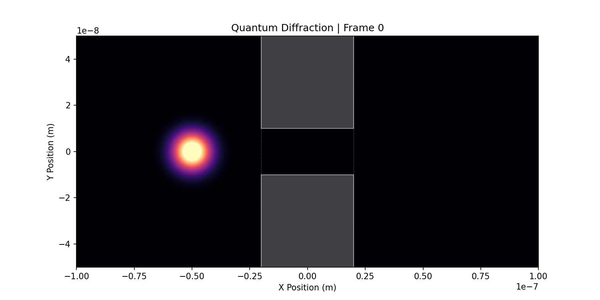
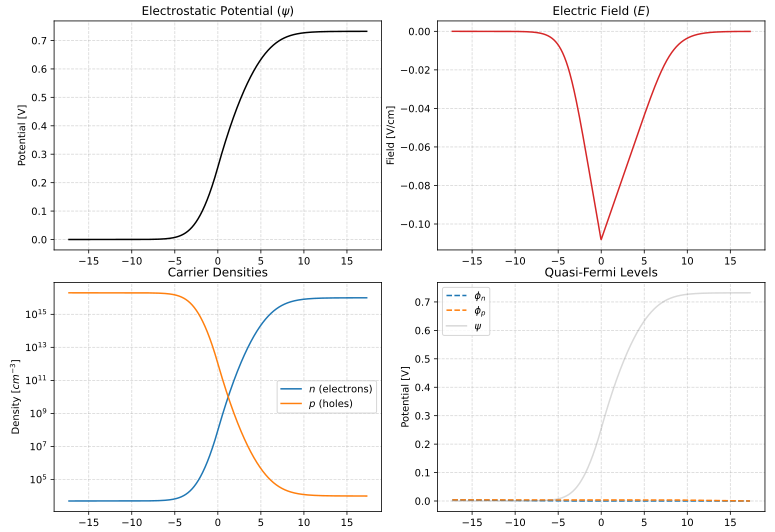

# VFVM-RS

VFVM-RS is a Rust library for solving partial differential equations (PDEs) using a cell-centered finite volume method on voronoi meshes.

The project is greatly inspired by the [VoronoiFVM.jl](https://github.com/WIAS-PDELib/VoronoiFVM.jl) Julia library developed at WIAS. Especially, their functional API design which is pretty awesome.

> [!WARNING]
> While it is "inspired" by VoronoiFVM.jl, this library is a toy project compared to the Julia project which is maintained by a team of experts. It has way less features, less documentation, less tests, and probably more bugs. Use at your own risk.

### Implementation Details

This library implements a **Cell-Centered Finite Volume Method** on Voronoi meshes.

The spatial discretization is based on a **Two-Point Flux Approximation**. The total flux $\Gamma_{kl}$ across a face $f$ separating two cells, $k$ and $l$, is computed by the library as:

$\Gamma_{kl} = \left( \frac{A_f}{d_{kl}} \right) \times f_{\text{user}}(u_k, u_l, \text{face}, \text{data})$

Where:
* **$A_f$** is the area of the shared face $f$.
* **$d_{kl}$** is the distance between the centroids of cell $k$ and cell $l$, calculated by the library.
* **$f_{\text{user}}(\dots)$** is the user-provided `FluxFn` closure, which defines the physical behavior of the flux based on the left-state $u_k$ and right-state $u_l$.

Boundary conditions are implemented using a **ghost cell** methodology. The library computes a "ghost" state outside the domain that enforces generalized (Robin) boundary conditions, which are then used as the "right-state" $u_l$ in the flux function for boundary faces.

The resulting system of (nonlinear) algebraic equations is solved using an inexact Newton method with Armijo line search. The Jacobian matrix required by the solver is calculated using **automatic differentiation** (`num_dual`), which provides the exact derivatives of the user's `FluxFn` and `ReactionFn` functions.

### Libraries Used
- [meshless_voronoi](https://github.com/yuyttenhove/meshless_voro) : which provides easy to use voronoi mesh generation
- [nalgebra](https://nalgebra.org/) : for linear algebra operations
- [num-dual](https://crates.io/crates/num-dual) : for automatic differentiation
- [kryst](https://github.com/tmathis720/kryst) : which provides ridiculously fast sparse matrix system solvers (at least the ones I tried i.e. BiCGStab).

### Main Things That Remain to be Done
- Implement more flexible solver API with different preconditioners etc...
- Implement better mesh generation, more functions to create different geometries. For a start, being able to create non-re ctangular domains would be nice.
- Make and test a 3D example
- Try to parallelize some stuff
- Improve documentation

### Debug vs Release Builds
Some correctness checks are only performed in debug builds:
- **Degenerate geometry detection**: `safe_distance()` warns if distance clamping occurs
- **Tolerance diagnostics**: Mesh calibration prints detailed statistics

It is thus good practice to run in debug mode when encountering unexpected behavior.

### Numerical Tolerances
The solver automatically calibrates numerical tolerances based on mesh characteristics:
- `min_distance`: Set to 1e-8 × minimum cell spacing to prevent degenerate geometry
- This ensures the tolerance scales appropriately with problem normalization
- Manual override available via `.with_tolerances()` if needed

### Commands
To test for similarity between sparse and dense representations and get some metrics on similarity printed out :
- `cargo test -- --nocapture`
To run the main PN junction simulation with timing information :  
- `cargo run --release --features timing`
To run an example :
- `cargo run --example capactor`
To run the benchmarks (not recommended yet) :
- `cargo bench`

### Examples 
- [capacitor.rs](examples/capacitor.rs) : 2D capacitor potential simulation
- [particle.rs](examples/particle.rs) : transient simulation of a quantum particle moving through a 2D potential gap
- [pn_junction.rs](src/main.rs) : 1D PN junction semiconductor device under equilibrium conditions

